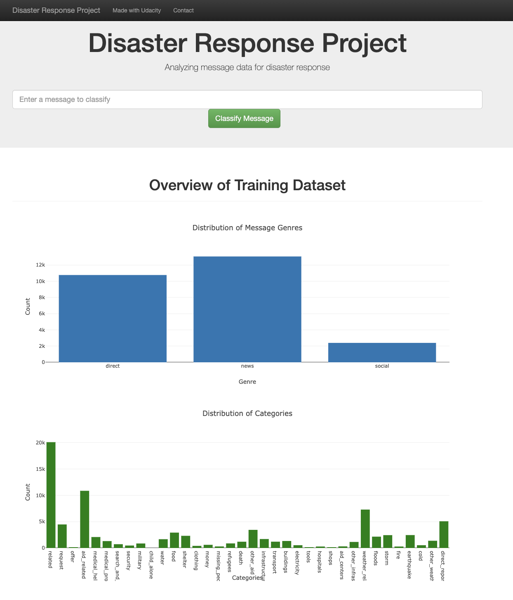

# Disaster Response Pipeline Project

### Table of Contents

1. [Project Summary](#summary)
2. [Installation](#installation)
3. [File Descriptions](#files)
4. [Instructions](#instructions)
5. [Results](#results)
6. [Licensing, Authors, and Acknowledgements](#licensing)

## Project Summary

This is the second project of Udacity Nanodegree "Data Scientist".
The data for this project was was provided by [Figure Eight](https://www.figure-eight.com/) and contains emergency messages from the past and categories for the respective messages (e.g. fire, flood, child alone, etc.).
I used this data (messages and repective categories) to train a machine learning pipeline for the categorization of new emergency messages coming in. 
The resulting model was then visualized using a web app in order to make it more accessible. The web app contains a user interface where the user (e.g. emergency staff) can enter a new emergency message and receives a categorization based on the machine learning model immediately. 
This project is of very high relevance, not only in theory but in real life as it can literally save lifes. In case of an emergency every second counts and processes need to be automated to a maximum. Reducing the time between an incoming emergency message and help arriving is crucial here. This model can help to accomplish that. 

## Installation 

I used Anaconda Navigator 2.5.1 (including python 3.11.5) throughout this project. 
The following libraries are used, most of them are already included in Anaconda.  

    Data Preparation
        - sys
        - pandas
        - sqlalchemy
    Model Estimation
        - nltk
        - sklearn
        - numpy
        - re
        - pickle
    Building Web App
        - json
        - plotly
        - joblib
        - flask

## File Descriptions 

The following input files were used/created throughout the project: 

~~~~~~~
        project2_disaster_response_pipeline_project
          |-- app
                |-- templates
                        |-- go.html
                        |-- master.html
                |-- run.py
          |-- data
                |-- disaster_categories.csv
                |-- disaster_message.csv
                |-- process_data.py
          |-- models
                |-- train_classifier.py
          |-- screenshots
                |-- app.png
          |-- README.md
~~~~~~~

The following output files are created when running the project: 

    data_processed_etl.db >> sqlite database containing preprossessed data after running process_data.py
    classifier.pkl >> resulting machine learning model after running train_classifier.py

## Instructions

1. Run the following commands in the project's root directory to set up the database (data_processed_etl.db) and model (classifier.pkl).

    - To run ETL pipeline that cleans data and stores in database
        `python data/process_data.py data/disaster_messages.csv data/disaster_categories.csv data/DisasterResponse.db`
    - To run ML pipeline that trains classifier and saves
        `python models/train_classifier.py data/DisasterResponse.db models/classifier.pkl`

2. Run the following command in the app's directory to run your web app.
    `python run.py`

3. Go to http://0.0.0.0:3001/

## Results

After running the three python files 1) process_data.py 2) train_classifier.py and 3) run.py including the relevant information on input and output paths the user should receive the url to open the web app containing some visualizations on the starting page. 

## Licensing, Authors, Acknowledgements

Thank you Figure Eight for making the data available to public. Also thanks to Udacity GPT for helping me with various syntax errors.
